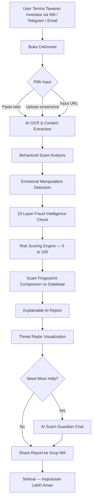
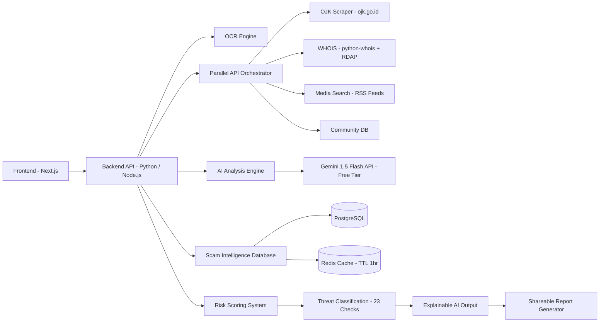
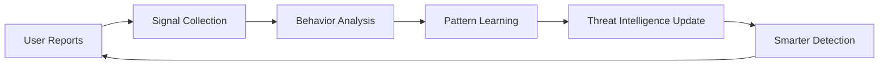

# PRODUCT REQUIREMENTS DOCUMENT (PRD)

# CekInvest — AI Financial Threat Intelligence Platform

**Version:** 2.1 — Zero Budget Edition  
**Last Updated:** May 2026  
**Status:** Active Development  
**Infrastruktur:** 100% Free Tier — Rp 0 / bulan

---

# 1. Overview

**CekInvest** adalah platform berbasis AI yang membantu pengguna mendeteksi potensi penipuan finansial secara cepat, sederhana, dan explainable — sebelum transfer terjadi.

Platform ini memungkinkan pengguna untuk:

- paste chat WhatsApp / Telegram
- upload screenshot penawaran investasi
- memasukkan link investasi / URL website
- menganalisis pola manipulasi finansial secara real-time
- mendapatkan penjelasan risiko dalam bahasa manusia biasa

CekInvest bukan sekadar platform blacklist atau cek legalitas, tetapi:

> **AI-powered Financial Threat Intelligence System** yang memahami pola manipulasi psikologis, skema ponzi, fake urgency, dan behavioral scam pattern — jauh sebelum OJK sempat mendaftarkannya.

---

# 2. Objectives

## Primary Goals

- Membantu masyarakat Indonesia menghindari scam finansial sebelum transfer dilakukan
- Menyederhanakan proses validasi investasi menjadi < 10 detik
- Memberikan AI explanation yang mudah dipahami tanpa jargon teknis
- Mendeteksi pola scam lebih awal sebelum viral dan sebelum ada korban massal
- Menjadi "financial safety layer" untuk pengguna digital Indonesia
- Membangun community fraud intelligence database terbesar di Indonesia

---

## Success Metrics

### Engagement
- ≥ 85% pengguna memahami risiko scam dalam < 30 detik
- ≥ 70% user menggunakan fitur lebih dari 2x/minggu
- ≥ 80% hasil analisis dianggap membantu
- ≥ 60% screenshot/chat berhasil dianalisis dengan benar
- ≥ 40% retention pengguna aktif bulan ke-3

### Impact
- ≥ 500.000 analisis dilakukan dalam 12 bulan pertama
- ≥ 10.000 laporan komunitas dikumpulkan untuk memperkuat database
- ≥ 1 kemitraan institusional (OJK / bank / media) aktif di akhir tahun 1
- Estimasi kerugian yang dicegah: Rp 50–200 miliar (year 1)

### Quality
- Akurasi deteksi scam terkonfirmasi ≥ 78% (divalidasi dari laporan OJK)
- False positive rate ≤ 12% (investasi legit dianggap scam)
- Waktu analisis end-to-end ≤ 10 detik

---

# 3. Problem Statement

## Skala Krisis

Kerugian akibat investasi bodong di Indonesia mencapai **Rp 10,9 triliun per tahun** (OJK, 2024) — setara dengan membangun 54 rumah sakit tipe A. Setiap rupiah dalam angka itu adalah tabungan pensiun yang hilang, biaya kuliah anak yang lenyap, rumah yang tidak jadi dibeli.

## Mengapa Orang Terus Menjadi Korban

Scam investasi modern dirancang secara psikologis untuk mematikan critical thinking sebelum otak sempat berpikir:

- **FOMO buatan** — "Hanya 24 jam lagi, slot sudah hampir habis"
- **Social proof palsu** — Testimoni aktor bayaran, screenshot profit rekayasa
- **Authority bias** — Foto dengan pejabat atau tokoh publik tanpa izin
- **Anchoring bertahap** — Return kecil yang terasa masuk akal di bulan pertama
- **Isolasi korban** — "Jangan cerita ke siapa-siapa dulu, ini eksklusif"

Bukan hanya yang tidak terpelajar yang menjadi korban. Dokter, guru, PNS, akademisi — semua bisa terjebak karena ini bukan soal kecerdasan, tapi soal sistem psikologis yang lebih cepat dari nalar kritis.

## Gap yang Belum Terisi

OJK memiliki daftar entitas ilegal, namun:

- Tersebar dalam PDF yang tidak searchable
- Diperbarui 2–4 minggu setelah modus beroperasi
- Tidak ada antarmuka yang bisa diakses warga biasa dalam hitungan detik

Gap antara *"data tersedia"* dan *"dapat diakses saat dibutuhkan"* inilah yang CekInvest dirancang untuk menutupnya.

## Masyarakat yang Terpapar

- Investasi bodong (robot trading, koperasi digital, multi-level)
- Scam crypto (rug pull, fake yield farming, NFT scam)
- Phishing finansial (fake bank, fake OJK)
- Fake job opportunity berujung penyetoran uang
- Affiliate scam & social engineering via media sosial

---

# 4. Target Users

## 4.1 Persona 1 — Bu Umi: Korban Rentan dengan Niat Baik

**Profil:** Guru SD, 52 tahun, Tasikmalaya. Melek smartphone tapi tidak melek finansial digital.

**Situasi:** Menerima tawaran "koperasi digital return 15%/bulan" via grup WhatsApp arisan. Tidak bisa membedakan mana yang legal, mana yang tidak. Hampir mentransfer Rp 30 juta tabungan pensiun.

**Pain Points:**
- Tidak tahu harus cek ke mana
- Malu bertanya ke anak karena takut dikira tidak pintar
- Percaya pada rekomendasi sesama anggota arisan

**Kebutuhan:** Jawaban cepat dalam bahasa sederhana, bisa digunakan tanpa tutorial, tidak menimbulkan rasa malu.

---

## 4.2 Persona 2 — Dr. Reza: Profesional Sibuk tanpa Waktu Riset

**Profil:** Dokter spesialis, 38 tahun, Surabaya. Pendapatan tinggi, waktu untuk riset investasi sangat terbatas.

**Situasi:** Menerima pitch deck robot trading dari teman dokter terpercaya. Tidak curiga karena sumber dari lingkaran sosial sendiri. Mempertimbangkan investasi Rp 200 juta.

**Pain Points:**
- Terlalu sibuk untuk melakukan due diligence mendalam
- Terlalu percaya pada referral dari lingkaran profesional
- Tidak punya framework cepat untuk evaluasi awal

**Kebutuhan:** Analisis cepat yang bisa di-share ke teman yang mengirimkan tawaran, tanpa terasa menuduh.

---

## 4.3 Persona 3 — Arif: Digital Native yang Overconfident

**Profil:** Fresh graduate, 27 tahun, Jakarta. Aktif di komunitas crypto Telegram, merasa sudah paham dunia investasi.

**Situasi:** Melihat banyak "alpha call" dan project baru setiap hari. Ingin untung tapi tidak punya framework untuk memilah yang asli dari rug pull. Pernah rugi Rp 5 juta dari project NFT.

**Pain Points:**
- Terlalu percaya pada hype komunitas
- Sulit membedakan FOMO yang rasional dari manipulasi
- Tidak ada alat analisis teknikal yang mudah diakses

**Kebutuhan:** Analisis pattern database modus baru, deteksi teknikal, bisa dipakai cepat saat diskusi sedang berlangsung di Telegram.

---

## 4.4 Target Sekunder (Institutional)

- **OJK / Satgas Waspada Investasi** — sebagai mitra data dan penerima fraud intelligence feed
- **Perbankan** — integrasi di flow transfer untuk pop-up peringatan otomatis
- **Media investigasi** — akses API untuk fact-checking dan pelaporan
- **Komunitas literasi keuangan** — alat edukasi berbasis kasus nyata

---

# 5. Core Features

## 5.1 Multi-Input AI Scam Analysis

User dapat mengirimkan input dalam tiga format:

| Input      | Cara            | Keterangan                                            |
| ---------- | --------------- | ----------------------------------------------------- |
| Teks       | Paste langsung  | Chat WA, Telegram, email, teks brosur digital         |
| Screenshot | Upload / kamera | OCR otomatis ekstrak teks dari gambar                 |
| URL        | Input link      | Analisis website: domain, konten, WHOIS, SSL, hosting |

AI akan menghasilkan dalam < 10 detik:
- **Risk Score 0–100** — angka tunggal yang bisa dibaca siapapun
- **Red Flag Breakdown** — setiap temuan dijelaskan dalam bahasa manusia
- **Status OJK** — cross-check real-time database entitas legal/ilegal
- **Pertanyaan Jebakan** — 3–5 pertanyaan spesifik untuk ditanyakan ke penawari
- **Shareable Report** — link atau ringkasan yang bisa dikirim balik ke grup

---

## 5.2 Emotional Manipulation Detection

AI mendeteksi 6 jenis manipulasi psikologis yang paling umum dalam scam investasi Indonesia:

- **Fake urgency** — frasa pemicu FOMO: "hanya hari ini", "batas waktu 2 jam"
- **Fake scarcity** — "slot hanya 50 orang", "sudah hampir penuh"
- **Fake authority** — klaim dukungan pejabat, tokoh publik, lembaga resmi
- **Unrealistic return** — janji return di atas batas logis pasar modal
- **Emotional pressure** — ancaman kehilangan kesempatan, tekanan sosial
- **Social proof manipulation** — testimoni tidak terverifikasi, screenshot profit palsu

---

## 5.3 23-Layer Fraud Intelligence Check

Sistem menjalankan 23 pemeriksaan secara paralel, dikelompokkan dalam 4 kategori:

### Kategori A — Regulasi OJK (6 checks)

| #   | Pemeriksaan                   | Deskripsi                                                          |
| --- | ----------------------------- | ------------------------------------------------------------------ |
| 01  | Status database OJK real-time | Cross-check nama entitas di daftar legal/ilegal OJK terkini        |
| 02  | Verifikasi izin SIUP / OJK    | Nomor izin yang diklaim: valid, aktif, sesuai jenis usaha          |
| 03  | Klaim jaminan profit          | Investasi legal dilarang menjamin keuntungan (UU Pasar Modal)      |
| 04  | Ketentuan penarikan           | Lock-up tidak wajar, biaya penarikan tinggi, mekanisme tidak jelas |
| 05  | Struktur dokumen legal        | Perjanjian tanpa notaris, klausul yang menghilangkan hak hukum     |
| 06  | Konsistensi entitas hukum     | Nama badan usaha vs dokumen legal vs rekening penerima             |

### Kategori B — AI Linguistics (7 checks)

| #   | Pemeriksaan                         | Deskripsi                                                         |
| --- | ----------------------------------- | ----------------------------------------------------------------- |
| 07  | Pola bahasa urgensi buatan          | Frasa pemicu: "hanya hari ini", "jangan kasih tahu orang lain"    |
| 08  | Deteksi skema Ponzi                 | Mekanisme rekrut-bayar sebagai sumber utama return                |
| 09  | Konsistensi nama entitas            | Variasi nama mirip brand resmi: brand confusion attack            |
| 10  | Klaim kerahasiaan berlebihan        | Isolasi korban: "hanya untuk orang terpilih", NDA di awal         |
| 11  | Kejelasan mekanisme investasi       | Return tidak bisa dijelaskan secara logis dari aset nyata         |
| 12  | Deteksi social proof rekayasa       | Pola testimoni terlalu sempurna, anggota tidak verifiable         |
| 13  | Klaim teknologi tidak terverifikasi | AI bot, algoritma rahasia, teknologi eksklusif tanpa bukti teknis |

### Kategori C — Data & Intelligence (7 checks)

| #   | Pemeriksaan                    | Deskripsi                                                      |
| --- | ------------------------------ | -------------------------------------------------------------- |
| 14  | Kesesuaian return dengan pasar | Return > 3%/bulan melebihi batas logis pasar modal Indonesia   |
| 15  | Analisis usia domain website   | Domain < 90 hari + klaim berpengalaman = red flag kuat         |
| 16  | Analisis SSL dan hosting       | Hosting anonimous / negara tax haven = operasi cepat kabur     |
| 17  | Verifikasi foto testimonial    | Reverse image search: foto stock atau profil palsu             |
| 18  | Verifikasi tokoh yang diklaim  | Figur publik benar-benar terlibat atau nama dipakai tanpa izin |
| 19  | Konsistensi lintas platform    | Informasi di website vs WA vs Instagram berbeda-beda           |
| 20  | Cek pemberitaan media          | Berita negatif tentang nama entitas dalam 24 bulan terakhir    |

### Kategori D — Community Intelligence (3 checks)

| #   | Pemeriksaan               | Deskripsi                                                |
| --- | ------------------------- | -------------------------------------------------------- |
| 21  | Rekening bank dilaporkan  | Nomor rekening pernah dilaporkan komunitas CekInvest |
| 22  | Nomor telepon / WhatsApp  | Nomor masuk database scam Indonesia dan global           |
| 23  | Crowdsourced fraud signal | Laporan pengguna yang pernah terima tawaran identik      |

---

## 5.4 AI Scam Guardian Chat

Setelah menerima laporan analisis, pengguna dapat melanjutkan percakapan dengan AI Scam Guardian untuk:

- Mengajukan pertanyaan lanjutan tentang temuan
- Mendapatkan template pesan untuk dikonfirmasikan ke penawari
- Memahami mekanisme scam yang terdeteksi secara lebih dalam
- Melaporkan temuan baru untuk memperkuat database komunitas

---

## 5.5 Shareable Safety Report

Setiap hasil analisis menghasilkan laporan yang bisa dibagikan:

- **Link publik** — bisa dikirim ke siapapun tanpa perlu akun
- **Ringkasan WhatsApp-friendly** — teks pendek siap paste ke grup
- **Nada sopan dan tidak menghakimi** — "Saya cek dulu pakai CekInvest, ini hasilnya..." bukan "ini penipuan"

Fitur ini memungkinkan satu pengguna mencegah puluhan orang lain menjadi korban dalam satu langkah berbagi.

---

# 6. User Flow

---

# 7. System Architecture

### Strategi Kecepatan < 10 Detik

Seluruh API call (OJK, WHOIS, media search, community DB) berjalan **paralel**, bukan sequential. Database OJK di-cache dengan TTL 1 jam. Streaming response dimulai sebelum semua 23 checks selesai — pengguna melihat hasil parsial lebih cepat, experience terasa instan.

---

# 8. Tech Stack

## Frontend

- Next.js
- Tailwind CSS
- ShadCN UI

## Backend

- Python
- Node.js

## AI Layer 

- **Gemini gemini-2.5-flash** 
  - Primary LLM: behavioral analysis, linguistic pattern detection, explainable output
  - Google Search Grounding built-in: verifikasi real-time via Google tanpa API tambahan
  - Free tier: 1.500 request/hari, 15 request/menit
- **OCR Engine** → Tesseract 
- **Prompt Engineering** menggantikan Custom NLP Model di tahap MVP
  - System prompt yang dirancang khusus untuk pola scam bahasa Indonesia
  - Mencakup bahasa gaul, campuran dialek, dan eufemisme modus lokal
  - Dapat di-iterasi tanpa biaya training model

## Data Sources 

- **OJK Data** → Scraper otomatis dari `ojk.go.id` (data publik, tidak ada API berbayar)
  - Library: `requests` + `BeautifulSoup` (Python, free)
  - Di-cache setiap 1 jam di database lokal agar tidak hit website OJK terus-menerus
- **WHOIS / Domain Intel** → `python-whois` library (free, open source) + RDAP Protocol (`rdap.org` — free, standar ICANN)
- **Media Search** → RSS Feed gratis dari media Indonesia: Detik, Kompas, Tempo, CNBC Indonesia
  - Library: `feedparser` (Python, free)
  - Diperkuat Gemini Search Grounding untuk pencarian real-time
- **Reverse Image Check** → Gemini Vision (sudah dalam stack, tidak perlu API tambahan)
- **Phone / Rekening DB** → Database komunitas sendiri di PostgreSQL (dibangun dari laporan user)

## Database 

- **PostgreSQL** via Prisma 

## Infrastructure & Caching 

| Komponen             | Tool                | Free Tier                  |
| -------------------- | ------------------- | -------------------------- |
| Database & Auth      | Prisma              | 500 MB                     |
| Cache & Rate Limit   | Upstash Redis       | 10.000 request / hari      |
| Background Jobs      | Vercel Cron Jobs    | 1 job / hari (scraper OJK) |
| Image & File Storage | Vercel Blob Storage | 1 GB                       |

---

# 9. Privacy & Security

## Prinsip Utama

- Input pengguna **tidak disimpan secara identifiable** — hanya hash untuk deduplication
- Tidak ada akun wajib — analisis bisa dilakukan tanpa registrasi
- Community reports bersifat anonim
- Data agregat yang dijual ke institusi sudah dianonimkan sepenuhnya
- Tidak ada monetisasi data individual pengguna dalam bentuk apapun

## Trust-First Architecture

- Zero-knowledge processing: server tidak bisa menghubungkan analisis dengan identitas pengguna
- Screenshot dan chat diproses di server, tidak disimpan setelah analisis selesai
- Audit trail hanya untuk agregat statistik, bukan per-user

---

# 10. Product Roadmap

## Fase 1 — Web MVP (Bulan 1–4)

- Paste teks / URL → Risk Score + breakdown 12 checks pertama
- Integrasi OJK scraper (ojk.go.id) — diperbarui setiap jam, di-cache lokal
- Shareable report link
- Community report form
- Launch di Product Hunt dan komunitas literasi keuangan Indonesia
- **Kapasitas MVP:** ~1.500 analisis / hari (batas Gemini free tier)
- **Strategi:** aggressive caching — hasil analisis tawaran identik tidak memanggil Gemini ulang

## Fase 2 — Full Platform (Bulan 5–9)

- 23 pemeriksaan lengkap aktif
- AI Scam Guardian Chat
- iOS Share Extension (screenshot dari WA dianalisis via Gemini setelah di OCR Tesseract)
- Notifikasi modus baru mingguan via email (Resend free tier: 3.000 email/bulan)
- Community intelligence feed publik
- Onboarding mitra media pertama
- **Scaling:** jika traffic melebihi free tier Gemini → migrate ke Gemini 1.5 Flash berbayar ($0.075 / 1M token) — saat ini sudah ada revenue B2B untuk menutup ini

## Fase 3 — Ekosistem (Bulan 10+)

- API publik untuk institusi
- Dashboard OJK / Satgas mitra
- WhatsApp Bot integration
- Android app
- "Scam Museum" — arsip edukasi modus bersejarah Indonesia
- Realtime national scam map

---

# 11. Product Philosophy

## Core Philosophy

CekInvest percaya bahwa keamanan finansial digital harus:

- sederhana
- dapat diakses semua orang
- tidak menakutkan
- tidak membutuhkan pengetahuan teknis

AI tidak boleh terasa rumit atau mengintimidasi.

AI harus bekerja diam-diam di belakang layar untuk membantu pengguna mengambil keputusan yang lebih aman.

---

## Human-Centered Safety

Fokus utama produk bukan sekadar mendeteksi scam, tetapi:

- mengurangi kepanikan pengguna
- meningkatkan rasa percaya diri pengguna
- membantu pengguna memahami risiko dengan bahasa manusia

---

## Product Principles

### 1. Simplicity First

User harus bisa memahami aplikasi dalam hitungan detik.

### 2. Invisible Intelligence

AI bekerja secara powerful tanpa membebani pengguna dengan istilah teknis.

### 3. Explain Before Warning

Sistem harus menjelaskan alasan risiko sebelum memberikan warning.

### 4. Calm Experience

UX tidak boleh terasa menakutkan atau penuh alarm merah.

### 5. Zero-Learning Interaction

Tidak membutuhkan tutorial panjang atau pembelajaran kompleks.

---

# 12. Human Experience Principles

## Emotional UX Goals

Sebelum menggunakan CekInvest:

- pengguna bingung
- takut salah
- takut kehilangan uang

Setelah menggunakan CekInvest:

- pengguna merasa lebih tenang
- memahami risiko
- lebih percaya diri mengambil keputusan

---

## UX Direction

UX harus terasa seperti:

- asisten pintar yang duduk di sebelah kamu
- bukan dashboard cyber-security yang intimidatif

---

## Interaction Design Principles

- Minimal cognitive load
- Human-friendly language
- Conversational guidance
- Calm & modern animations
- High readability

---

# 13. Intelligence Flywheel

CekInvest dirancang sebagai sistem yang semakin pintar seiring waktu melalui community intelligence dan AI learning loop.

---

## Intelligence Sources

Sistem belajar dari:

- user reports (tawaran yang dilaporkan komunitas)
- scam screenshots (visual pattern dari modus baru)
- scam wording patterns (linguistic fingerprint tiap modus)
- suspicious URLs (domain, hosting, WHOIS anomaly)
- behavioral manipulation signals (pola psikologis yang berulang)
- confirmed OJK cases (ground truth dari kasus terkonfirmasi)

---

## Predictive Intelligence

Tujuan jangka panjang sistem adalah:

- mendeteksi scam sebelum viral (6–8 minggu lebih awal dari pengumuman OJK)
- mengenali pola scam baru dari sinyal komunitas mikro
- mengidentifikasi behavioral anomaly sebelum modus diketahui publik
- membangun scam knowledge graph Indonesia yang komprehensif

---

# 14. Trust & Transparency

## Explainable AI

AI harus menjelaskan:

- kenapa sebuah investasi dianggap berisiko
- pola manipulasi apa yang ditemukan
- bagian mana dari tawaran yang mencurigakan
- dengan contoh spesifik dari teks yang dianalisis, bukan generalisasi

---

## Transparency Principles

- Tidak mengklaim "100% akurat" — sistem memberikan risk indicators, bukan vonis
- Tidak langsung menyebut "penipuan" — menggunakan "ditemukan X indikator risiko tinggi"
- Fokus pada risk indicators & warning signals yang bisa diverifikasi pengguna sendiri
- Selalu sertakan langkah verifikasi mandiri yang bisa dilakukan pengguna

---

## Privacy Principles

- Data pengguna diproses secara aman dan tidak disimpan secara identifiable
- Screenshot / chat tidak digunakan tanpa izin eksplisit untuk training data
- Fokus pada trust-first architecture — pengguna harus merasa aman berbagi tawaran paling sensitif sekalipun

---

# 15. Long-Term Vision

CekInvest bukan hanya aplikasi checker.

Visi jangka panjang:

> **Menjadi financial immune system untuk masyarakat digital Indonesia** — infrastruktur keamanan finansial yang bekerja di belakang layar setiap transaksi digital, seperti antivirus untuk keputusan finansial.

---

## Future Ecosystem Potential

- Browser extension protection (deteksi saat browsing website investasi)
- WhatsApp AI assistant (analisis langsung di dalam WhatsApp)
- Scam intelligence API (untuk developer dan institusi)
- Bank fraud prevention layer (integrasi di flow transfer nasional)
- Realtime national scam map (visualisasi sebaran modus per provinsi)
- Financial safety infrastructure (menjadi standar keamanan industri fintech Indonesia)

---

# 16. Conclusion

CekInvest menghadirkan pendekatan baru terhadap keamanan finansial digital di Indonesia melalui AI yang memahami pola manipulasi manusia, 23-layer behavioral scam detection, dan explainable intelligence yang bisa dipahami siapapun dalam hitungan detik.

Kekuatan sesungguhnya bukan pada teknologinya — tapi pada momen yang dilayaninya: **10–30 menit antara tawaran masuk dan tombol transfer ditekan**. Di jendela kritis itulah CekInvest hadir, bekerja diam-diam, dan menyelamatkan keputusan.

---

*PRD ini merupakan dokumen hidup yang diperbarui seiring perkembangan produk dan feedback pengguna.*
